# 100 Days Of Code - [Jack Domleo](https://jackdomleo.dev)

[Twitter](https://twitter.com/jackdomleo7 "Follow me on Twitter") &bull; [GitHub](https://github.com/JDomleo "Follow me om GitHub or check out my projects") &bull; [CodePen](https://codepen.io/JackDomleo "Follow me on CodePen or check out my pens") &bull; [LinkedIn](https://www.linkedin.com/in/jack-domleo "Connect with me on LinkedIn")

## Welcome to my journey!

**Commit tweet:** https://twitter.com/jackdomleo7/status/1265321691108032513

[100daysofcode.com](https://100daysofcode.com) &bull; [#100DaysOfCode](https://twitter.com/hashtag/100DaysOfCode) &bull; [@ka11away](https://twitter.com/ka11away)

### Challenge Goals

By day 100, I would like to have had exposure to or learned:

- Animation (GSAP and/or anime.js)
- Neumorphic design
- CodePen challenges
- Single div CSS art
- LESS and/or Stylus
- Pug and/or Haml
- Improve currently live projects
  - [jackdomleo.dev](https://jackdomleo.dev)
  - [ellaparsons.design](https://ellaparsons.design)
  - [www.tmdip.co.uk](https://www.tmdip.co.uk)
  - [Cooltipz.css](https://cooltipz.jackdomleo.dev)

Fairly small list, but I really want to focus on these areas properly because I feel spending a lot of time dedicated to these topics will really improve my front-end skills.

### Contents

* [Rules](rules.md)
* [FAQ](FAQ.md)
* [Resources](resources.md)

---

### Day 1: May 26, 2020
##### Vue `<transition>` as part of a CodePen challenge

**Today's Progress**: Participated in the 4th part of CodePen's May 2020 challenge, [Vue Transitions](https://codepen.io/challenges/2020/may/4), so created an Alan Sugar firing list.

**Thoughts:** I only really know as much as CSS transitions and keyframes. I'd really like to learn more web animation but not sure where to start. Check out my [tweet](https://twitter.com/jackdomleo7/status/1265052767850237954). But this was a good first insight into Vue transitions and it was also nice that I'm already familiar with Vue.js.

**Tweet:** https://twitter.com/jackdomleo7/status/1265323818991697923

**Link to work:** [Alan Sugar's Fired Employees on CodePen](https://codepen.io/JackDomleo/pen/gOayzNY)

[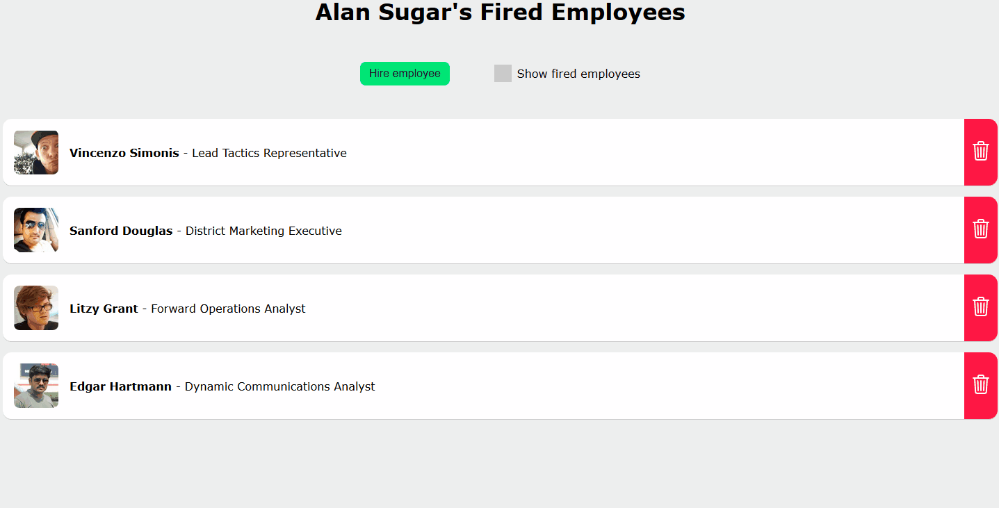](https://codepen.io/JackDomleo/pen/gOayzNY)

---

### Day 2: May 27, 2020
##### Neumorphic Design

**Today's Progress**: I've recently been fascinated with neumorphic design, so I went and learned how to create neumorpic components.

**Thoughts:** I really enjoyed doing this. I created several CodePen pens and I wrote a blog to further my understanding. Even though neumorphic design never really took off, I probably won't use or recommend it commercially, however I will definitely use it when creating little neat CodePens.

**Tweet:** https://twitter.com/jackdomleo7/status/1265672557333753862

**Link to work:**
- [Blog](https://jackdomleo.dev/blog/learning-neumorphic-design)
- [CodePen collection](https://codepen.io/collection/XjYaOy)
- [Neumorphic Design Elements CodePen](https://codepen.io/JackDomleo/pen/mdeowoz)
- [Neumorphic Music Player UI CodePen](https://codepen.io/JackDomleo/pen/GRpaNGp)
- [Choosing a neumorphic font-family CodePen](https://codepen.io/JackDomleo/pen/dyYEdPg)
- [Understanding neumorphic design shadows CodePen](https://codepen.io/JackDomleo/pen/yLYWqoQ)

---

### Day 3: May 28, 2020
##### Union Jack flag and learning anime.js

**Today's Progress**: I decided to create a little CodePen of the Union Jack flag and start learning anime.js

**Thoughts:** The Union Jack flag was interesting because it allowed me to think of how the flag should be structured. I ultimtaely ended up using simple blocks for the red St George's flag, then furthering my understanding of `linear-gradient` with the St Andrew's flag and St Patrick's flag. I also began learning [anime.js](https://animejs.com) for web animation which I hope to be continuing for 4-5 days.

**Tweet:** https://twitter.com/jackdomleo7/status/1265956691033587713

**Link to work:**
- [Union Jack CodePen](https://codepen.io/JackDomleo/pen/abvrgEo)
- [Learning anime.js CodePen](https://codepen.io/JackDomleo/pen/xxwoEZO)

---

### Day 4: May 29, 2020
##### Web animation - anime.js and GSAP

**Today's Progress**: I began learning [anime.js](https://animejs.com) yesterday and sadly we did not get on, so I started over with [GSAP](https://greensock.com/gsap)

**Thoughts:** Learning GSAP was really fun, I began by making a simple spinning smiley face animation on CodePen. I'm not entirely sure what went wrong with myself and anime.js but hopefully I can revisit it later and try again. But for now, I'm impressed with GSAP! I was curious as to whether other people preferred anime.js or GSAP, so I created a [Twitter poll](https://twitter.com/jackdomleo7/status/1266140324767899648).

**Tweet:** https://twitter.com/jackdomleo7/status/1266291364964085761

**Link to work:** [Spinning Smiley Face CodePen](https://codepen.io/JackDomleo/pen/wvKLjVb)

---

### Day 5: May 30, 2020
##### Web animation - GSAP

**Today's Progress**: Carried on with [GSAP](https://greensock.com/gsap) today, a little lost on ideas and felt a bit demotivated

**Thoughts:** I've been struggling with web animation to be honest, in the sense of - I feel idealess, had a few 'gotcha' moments with timing, messy JS and just feeling like I'm not in the right vibe for web animation, it's more of a designer job. Anywho, I'm determined to carry on because I am genuinely interested in learning more and improving my web animation skills.

**Tweet:** https://twitter.com/jackdomleo7/status/1266847508027883521

**Link to work:** [Day/Night Animation CodePen](https://codepen.io/JackDomleo/pen/NWGQjvW)

[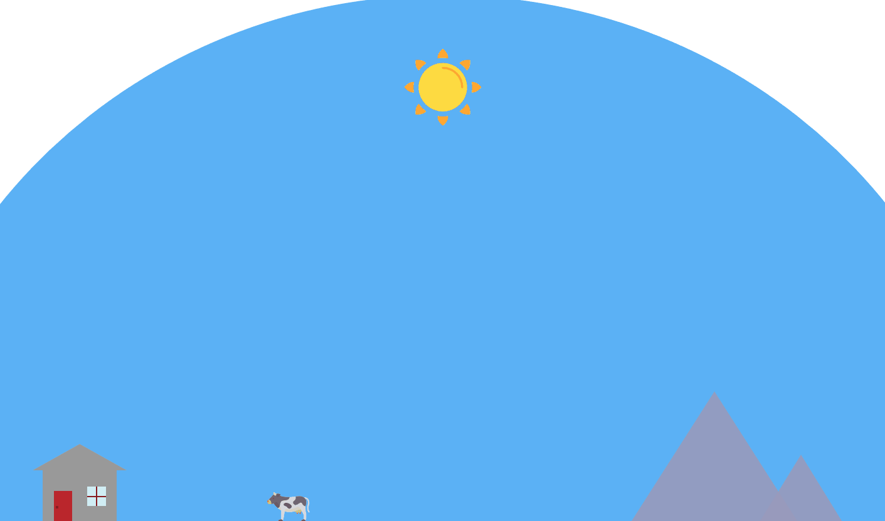](https://codepen.io/JackDomleo/pen/NWGQjvW)

---

### Day 6: May 31, 2020
##### Web animation - GSAP

**Today's Progress**: Finished the Day/Night [GSAP](https://greensock.com/gsap) animation, wasn't particularly happy with myself

**Thoughts:** I've been feeling a bit deflated with my progression on web animation. I wasn't happy with where my skills were. I had to remind myself that it's OK, it will take time, I just need to keep creating lots of animations and eventually my understanding will get there, a very similar approach to how I learned CSS. I've decided to take a little break from web animation and move onto to something else and revisit it in a week or two, hopefully in that time I may discover some free courses and/or more inspirational ideas.

**Tweet:** https://twitter.com/jackdomleo7/status/1267162870695034886

**Link to work:** [Day/Night Animation CodePen](https://codepen.io/JackDomleo/pen/NWGQjvW)

---

### Day 7: June 1, 2020
##### Neumorphic design

**Today's Progress**: Resumed on my neumorphic design CodePen and collection

**Thoughts:** I decided to take a break from animation today and focus on a few more neumorphic element ideas of mine. I created an analogue and digital clock and various loaders. Looking to resume animation tomorrow with the new CodePen challenge on GSAP.

**Tweet:** https://twitter.com/jackdomleo7/status/1267559349293121537

**Link to work:**
- [CodePen collection](https://codepen.io/collection/XjYaOy)
- [Neumorphic Design Elements CodePen](https://codepen.io/JackDomleo/pen/mdeowoz)

---

### Day 8: June 2, 2020
##### GSAP Sequencing Animation

**Today's Progress**: Revisted web animation with CodePen's [GSAP](https://greensock.com/gsap) Sequencing challenge and watched animation tutorials

**Thoughts:** Interesting day. Took the opportunity to look at what others had submitted for their GSAP sequencing animation CodePen challenge, which inspired me to revisit animation ealrier than expected. Watched a few tutorials on GSAP, reading documentation is OK, but watching a tutorial, watching someone actually do is where it's at! Started an airplane CodePen animation that I hope to resume tomorrow with new things I've learned.

**Tweet:** https://twitter.com/jackdomleo7/status/1267824496544673799

**Link to work:**
- [Airplane Sequence Animation CodePen](https://codepen.io/JackDomleo/pen/ZEQzgLm)
- [GSAP Sequence CodePen challenge](https://codepen.io/challenges/2020/june/1)
- [Getting started with GSAP 3 Youtube](https://www.youtube.com/watch?v=M4GCT-2kaoo&feature=youtu.be)

---

### Day 9: June 3, 2020
##### GSAP Sequencing Animation & GSAP Morph SVG

**Today's Progress**: Resumed on my airplane sequence animation to look for improvements and tried out [GSAP](https://greensock.com/gsap)'s Morph SVG plugin

**Thoughts:** Worked on looking into easing and looking at how I could make the plane look more realistic. Also took the opportunity to watch more GSAP videos on topics I can use later and I created a CodePen to practise using GSAP's [Morph SVG plugin](https://greensock.com/morphsvg).

**Tweet:** https://twitter.com/jackdomleo7/status/1268195822287626243

**Link to work:**
- [Airplane Sequence Animation CodePen](https://codepen.io/JackDomleo/pen/ZEQzgLm)
- [SVG Morph GSAP CodePen](https://codepen.io/JackDomleo/pen/abdbMwE)

---

### Day 10: June 4, 2020
##### Alternative JS & CSS Libraries

**Today's Progress**: Researched into lots of unusual, obscure JS and CSS libraries

**Thoughts:** Decided to take a break from actually creating something today, so I played around with lots of different JS & CSS libraries and created CodePen collections to share with others and reference later. My particular favourites were [Particles.js](https://vincentgarreau.com/particles.js), [Rough.js](https://roughjs.com) and [Softripple.js](https://codepen.io/dev_loop/full/KKVKqrq). I also spent some time going through [Dribbble](https://dribbble.com) as I need some ideas to start improving [ellaparsons.design](https://ellaparsons.design).

**Tweet:** https://twitter.com/jackdomleo7/status/1268610668489510921

**Link to work:**
- [Alternative JS Libraries CodePen collection](https://codepen.io/collection/nrpJyk)
- [Alternative CSS Libraries CodePen collection](https://codepen.io/collection/XjYeeW)

---

### Day 11: June 5, 2020
##### Adding a portfolio page to ellaparsons.design

**Today's Progress**: Spent today adding a portfolio page to ellaparsons.design to better ready her for her graphic designer job interviews

**Thoughts:** Wanted to make sure the UI was really good so researched into different types of 'cards' I could style. Eventually found one that I spun off into my own that matched the rest of the site. Also tidied up some HTML, CSS & JS/TS.

**Tweet:** https://twitter.com/jackdomleo7/status/1269026924434722817

**Link to work:** [ellaparsons.design](https://ellaparsons.design/portfolio)

[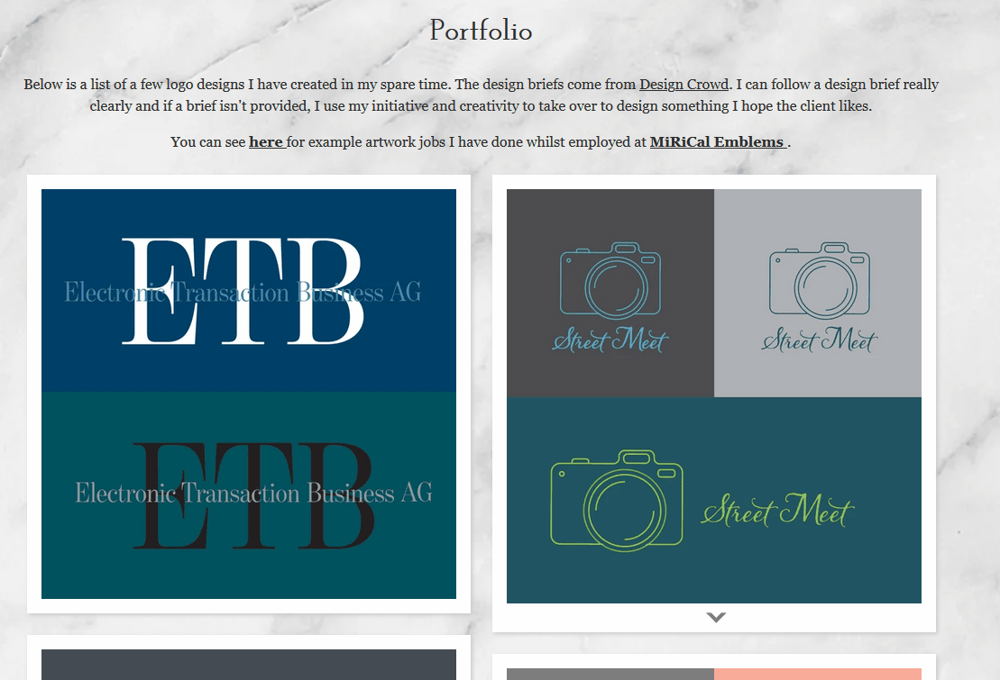](https://ellaparsons.design/portfolio)

---

### Day 12: June 6, 2020
##### Purchased CodePen PRO

**Today's Progress**: Spent today playing around with the features included in [CodePen PRO](https://codepen.io/pro)

**Thoughts:** CodePen PRO was definitely worth the investment, I will make good use out of the features it provides! Plus I get a cool "PRO" badge 😎.

**Tweet:** https://twitter.com/jackdomleo7/status/1269410630303350786

**Link to work:** [Customise CodePen profile page](https://codepen.io/JackDomleo/pen/pogJWex)

---

### Day 13: June 7, 2020
##### Adding avatars to ellaparsons.design and fixing CSS

**Today's Progress**: Not a lot of time was available to me today, but with the time I had, I added neat, little avatars to ellaparsons.design

**Thoughts:** The avatars were quite easy to make with the [memojis](https://support.apple.com/en-gb/guide/iphone/iph37b0bfe7b/ios) coming from Apple. I also fixed some CSS bugs with the wreath on the homepage and the portfolio cards I created on [Day 11](#day-11-june-5-2020).

**Tweet:** https://twitter.com/jackdomleo7/status/1269778126416027649

**Link to work:** [ellaparsons.design](https://ellaparsons.design/portfolio)

---

### Day 14: June 8, 2020
##### Re-architect blog with Nuxt Content

**Today's Progress**: My blog was my own implmentation of markdown embedded inside Vue. It was rushed when I did then a few months ago and have been putting off refactoring it.

**Thoughts:** I first looked at [frontmatter-makrdown-loader](https://github.com/hmsk/frontmatter-markdown-loader) package, but after many failed attempts and searching through its GitHub issues, I finally found my answer "Don't use this package, use Nuxt Content instead". 😨 I looked into [Nuxt Content](https://content.nuxtjs.org) and started implementing it. I struggled fetching the markdown files because the documentation on this particular section was thin, but I neglected to thoroughly read the homepage: there was an embedded code [Sandbox](https://codesandbox.io/s/nuxtcontent-demo-l164h?from-embed) with the solution to fetch markdown files... That's it for the day I think.

**Tweet:** https://twitter.com/jackdomleo7/status/1270343913681948672

**Link to work:** [GitHub repository](https://github.com/JDomleo/jackdomleo.dev)

---

### Day 15: June 9, 2020
##### Created an awful CodePen for #NoPreviewHtmlCss

**Today's Progress**: A few days ago, I created a challenge called #NoPreviewHtmlCss on Twitter and decided to take part in my own challenge.

**Thoughts:** The aim is to create something using HTML & CSS but you can't look at the preview until you are done (so you're coding blind). This was my attempt, I'm not proud 🤣. That being said, it was picked by CodePen and showcased on the homepage.

**Tweet:** https://twitter.com/jackdomleo7/status/1270504469764112385

**Link to work:** [Neutral Emoji: #NoPreviewHtmlCss Challenge on CodePen](https://codepen.io/JackDomleo/pen/yLeeJNZ)

---

### Day 16: June 10, 2020
##### Resumed re-architect blog with Nuxt Content

**Today's Progress**: Hit a very strange oddity with dates in JS and YAML...

**Thoughts:** This is going to be a long explanation, so sit back and relax:

I had this frontmatter in my blogs with the `date` in the YAML date format (13th June 2020).

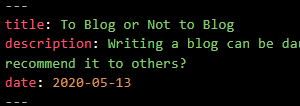

I then had a `articleDate()` function to fetch the articles to display on my blog list page, that worked fine. I then wanted to display the date of the blog, so I created a function to format each date with date-fn.

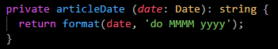

Here's the interesting thing, navigating to `localhost/blog/` worked perfectly 👌, but navigating to `localhost/blog` (no trailing slash), threw and error...

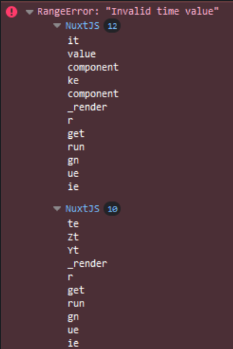

I knew it was a date issue, so I changed my code to output the raw date in collected from the blogs, here is what happened. (left: no trailing slash, right: trailing slash):

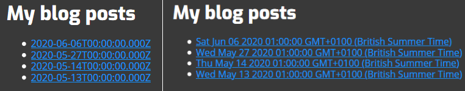

`/blog/` was outputting the expected output, a Date object, but `/blog` was outputting an ISO-8601 format... After hours of digging around and no progress, I decided to write my own fix, this does not fix what is returned, but this fixes the original `articleDate()` function:

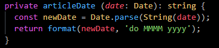

This will get the date from the blog, parse it as a string, then reparse it as a date, seems redundant for the `/blog/` URL, but it fixes the `/blog` URL, so I think it's worth it! It means now if there's a trailing slash or not, it still works! 😁😎

**Tweet:** https://twitter.com/jackdomleo7/status/1270742496503627778

**Link to work:** [GitHub repository](https://github.com/JDomleo/jackdomleo.dev)

[Update 17/06/2020 - This issue was resolved but nuxt/content in [v1.3.2](https://github.com/nuxt/content/releases/tag/v1.3.2) on 11/06/2020]

---

### Day 17: June 11, 2020
##### Web presence and blog open graph images

**Today's Progress**: Resumed on my blog by improving my web presence and creating a unique open graph for each blog post

**Thoughts:** Working on my website's metadata is always interesting. I learned about the `article` og meta tag with options such as `article:author` and `article:published_time`.

**Tweet:** https://twitter.com/jackdomleo7/status/1271213660275425280

**Link to work:** [GitHub repository](https://github.com/JDomleo/jackdomleo.dev)

---

### Day 18: June 12, 2020
##### Close to finishing rearchitecting and helped a friend sell his first website!

**Today's Progress**: My blog rearchitecture is almost finished and ready to be merged into master. Just a few minor additions. Helped [Devin Ford](https://twitter.com/devinDford) sell his first ever website!

**Thoughts:** I'm pleased with my blog improvement, finally getting markdown implemented will be so much more beneficial in the long run. [Devin](https://twitter.com/devinDford) approached me requesting help by taking a look and providing feedback on a website he created for his first client. I provided feedback on how the HTML, CSS & accessibility could be improved and was really pleased to know that the client agreed to purchase the website!

**Tweet:** https://twitter.com/jackdomleo7/status/1271585245867970561

**Link to work:** [GitHub repository](https://github.com/JDomleo/jackdomleo.dev)

---

### Day 19: June 13, 2020
##### Blog improvement

**Today's Progress**: Not a lot of coding time available to me today, so I added a few tweaks to my blog.

**Thoughts:** A good article has a clear, well formatted published date, some tags that may be relevant to the article and some links so other can share the article on social media. I added these today. Also made sure I made correct and effective use of the `<time datetime=""></time>` HTML tag.

**Tweet:** https://twitter.com/jackdomleo7/status/1271934825944014855

**Link to work:** [GitHub repository](https://github.com/JDomleo/jackdomleo.dev)

[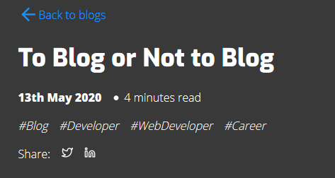](https://github.com/JDomleo/jackdomleo.dev)

---

### Day 20: June 14, 2020
##### Finally finished implenting Nuxt Content into my blog and joined [DEV.to](https://dev.to/jackdomleo7)!

**Today's Progress**: Really happy to have merged my Nuxt Content branch into master, this is a big step into simplifying my blog and make writing easier.

**Thoughts:** I read [this article](https://www.colbyfayock.com/2020/06/how-to-grow-your-audience-and-share-your-content-with-the-world) by [Colby Fayock](https://twitter.com/colbyfayock) and took his advice on joining DEV to share my content, I also learned I can add a canonical link to the DEV article so my website's blog can get the DEV "SEO juice".

**Tweet:** https://twitter.com/jackdomleo7/status/1272315972377075717

**Link to work:** [First DEV.to article](https://dev.to/jackdomleo7/to-blog-or-not-to-blog-3npp)

[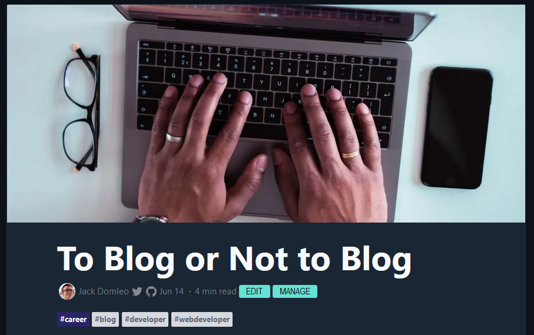](https://github.com/JDomleo/jackdomleo.dev)

---

### Day 21: June 15, 2020
##### Updated some website bits & published articles to [DEV.to](https://dev.to/jackdomleo7)

**Today's Progress**: Added the DEV icon and a 'Buy Me a Coffee' button to my website's footer. Created a new Twitter & LinkedIn banner. Published other existing articles from [jackdomleo.dev/blog](https://jackdomleo.dev/blog) to [DEV.to](https://dev.to/jackdomleo7).

**Thoughts:** I've had a tough fair few days battling Nuxt Content, I thought I'd take it easy today and do some little neat enjoyables tasks!

**Tweet:** https://twitter.com/jackdomleo7/status/1272667963791937537

**Link to work:**
- [All Day Hey! 2020 DEV.to](https://dev.to/jackdomleo7/all-day-hey-2020-3ek)
- [Learning Neumorphic Design DEV.to](https://dev.to/jackdomleo7/learning-neumorphic-design-3dj8)
- [Why to not support Internet Explorer](https://dev.to/jackdomleo7/why-to-not-support-internet-explorer-3f8h)

---

### Day 22: June 16, 2020
##### Added front-end fuzzy search to my blog page

**Today's Progress**: Using the same helper method for front-end fuzzy searching on my projects page, I decided to also add it to my blog page to make it easier (primarily for me) to find articles.

**Thoughts:** I love little tasks like these, so fun! You can filter by title, description, date, reading time and hashtags!

**Tweet:** https://twitter.com/jackdomleo7/status/1272845401054416896

**Link to work:** [jackdomleo.dev/blog](https://jackdomleo.dev/blog)

[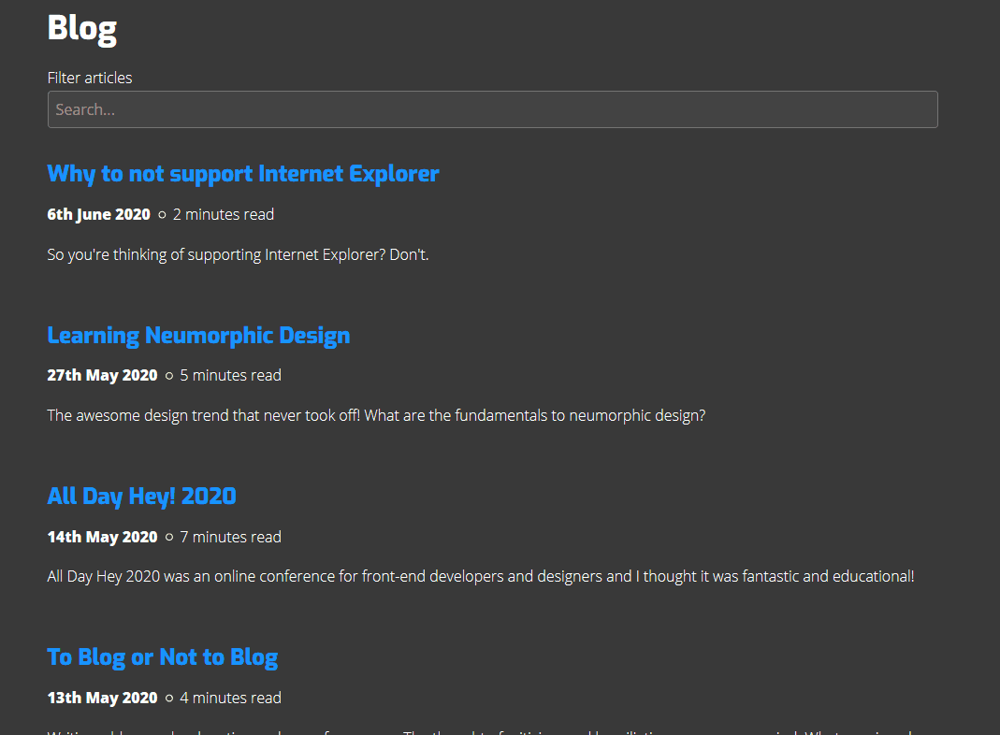](https://github.com/JDomleo/jackdomleo.dev)

---

### Day 23: June 17, 2020
##### Taking it easy...

**Today's Progress**: Took things slower today, gave myself time to think. I spent a lot of time reorganising my structure and approach to development. I signed up to [Evernote](https://www.evernote.com) for better and cleaner note taking. I also created rules for my emails so they'd go into certain folders because they were getting a bit too much. Made more progress on my article about my journey to being a developer. Read the first chapter of ["Responsive Web Design with HTML5 and CSS" by Ben Frain](https://amzn.to/2WKBcjJ) and began writing my review on it.

**Thoughts:** Feel like I'm nearing burnout. So much on my plate right now. All my coding related tasks are jumbled; I keep jumping between tasks because I don't know what to prioritise and I was becoming overwhelming. Not to mention my sudden popularity on Twitter and CodePen with the pressure that I feel I have to deliver. Thankgully, a colleauge of mine, [Andrew](https://twitter.com/ajbkr) offered me an invaluable phone call and some articles to read: ["Spinning plates in a world of stress"](https://msmotivator.me/2017/04/10/spinning-plates-in-a-world-of-stress) and ["The Jar of Life: First things First"](https://balancedaction.me/2012/10/17/the-jar-of-life-first-things-first).

**Tweet:**
- https://twitter.com/jackdomleo7/status/1273335663186894849
- https://twitter.com/jackdomleo7/status/1273337585134456838
- https://twitter.com/jackdomleo7/status/1273179565708500995

---

### Day 24: June 18, 2020
##### Writing, writing and more writing

**Today's Progress**: Wrote my first draft on an article, "How I went from a Retail Assistant at 17 to Landing a Developer Role at 19" and reviewed before I asked proofreaders to proof read. Also began my review on the book, "Responsive Web Design with HTML5 and CSS".

**Thoughts:** You don't realise how difficult writing is until you do it... But I'm happy with it, a few tweaks on my article needed before I send to proofreaders, mostly the tone needs altering.

**Tweet:** https://twitter.com/jackdomleo7/status/1273753607406604289

---

### Day 25: June 19, 2020
##### Published my "How I went from a Retail Assistant at 17 to Landing a Developer Role at 19" article

**Today's Progress**: I finally published this article after many days of planning and writing...

**Thoughts:** Thanks to the special help from [@DThompsonDev](https://twitter.com/DThompsonDev), [@anniebombanie_](https://twitter.com/anniebombanie_), [@NehemiahKiv](https://twitter.com/NehemiahKiv), [@sharifElkassed](https://twitter.com/sharifElkassed), [@hashtagcoder](https://twitter.com/hashtagcoder), [@godwin_kachi](https://twitter.com/godwin_kachi), [@notrohan_](https://twitter.com/notrohan_), [@js_nerd](https://twitter.com/js_nerd) and [@met1culousj](https://twitter.com/met1culousj) for helping the article be possible.

**Tweet:** https://twitter.com/jackdomleo7/status/1274077188720123904

**Link to work:** [jackdomleo.dev/blog/how-i-went-from-a-retail-assistant-at-17-to-landing-a-developer-role-at-19](https://jackdomleo.dev/blog/how-i-went-from-a-retail-assistant-at-17-to-landing-a-developer-role-at-19)

---

### Day 26: June 20, 2020
##### Reading

**Today's Progress**: "[Responsive Web Design with HTML5 and CSS](https://amzn.to/2WKBcjJ)" by [Ben Frain](https://benfrain.com)

**Thoughts:** A developer doesn't have to always be coding to be a developer. This is a really good book, so deserves a well written review. Also caught up on some articles from ym article backlog.

**Tweet:**
- https://twitter.com/jackdomleo7/status/1274471035128119296
- https://twitter.com/jackdomleo7/status/1274471037095346183

---

### Day 27: June 21, 2020
##### More Reading

**Today's Progress**: "[Responsive Web Design with HTML5 and CSS](https://amzn.to/2WKBcjJ)" by [Ben Frain](https://benfrain.com)

**Thoughts:** Still a really good book, so deserves a well written review.

**Tweet:** https://twitter.com/jackdomleo7/status/1274829077875130368

---

### Day 28: June 22, 2020
##### Sketching

**Today's Progress**: Began sketching a new layout for my website.

**Thoughts:** I've noticed most visitors visit my home page, then leave. I've been sketching ideas to make my homepage more appealing that I will develop in the coming days/weeks.

**Tweet:** Forgot to tweet 🤦‍♂️

---

### Day 29: June 23, 2020
##### Reading, helping, sketching, course planning

**Today's Progress**: Bit of an unplanned eventful day. I've read more of that [book](https://amzn.to/2WKBcjJ) mentioned previously, been mentoring/helping fellow developers on Twitter through direct messages, more sketches on website layout and relearning CSS basics to prepare me for a new course I've been asked to help create.

**Thoughts:** Relearning CSS is always exciting! Mentoring through Twitter direct messages is by far the biggest time consumer of my day 😅.

**Tweet:** https://twitter.com/jackdomleo7/status/1275554869697486851

---

### Day 31: June 24, 2020
##### GSAP & course planning

**Today's Progress**: Worked on a GSAP CodePen to celebrate reahing 100 CodePen followers. Also planned some more of the course I'm working on.

**Thoughts:** "Man... Animation is hard. Not the CSS or JS, but getting the artistic side of it ride with easing... 😅"

**Link to work**: [100 folowers CodePen](https://codepen.io/JackDomleo/pen/bGEWPLy)

**Tweet:** Forgot to tweet 🤦‍♂️

---

### Day 32: June 25, 2020
##### Website improvements

**Today's Progress**: Working on improving my website. Added a portfolio page and some additions to the homepage.

**Thoughts:** This makes me realise I should working through consider a UI design course.

**Link to work**: [Website portfolio page](https://jackdomleo.dev/portfolio)

**Tweet:** Forgot to tweet 🤦‍♂️

[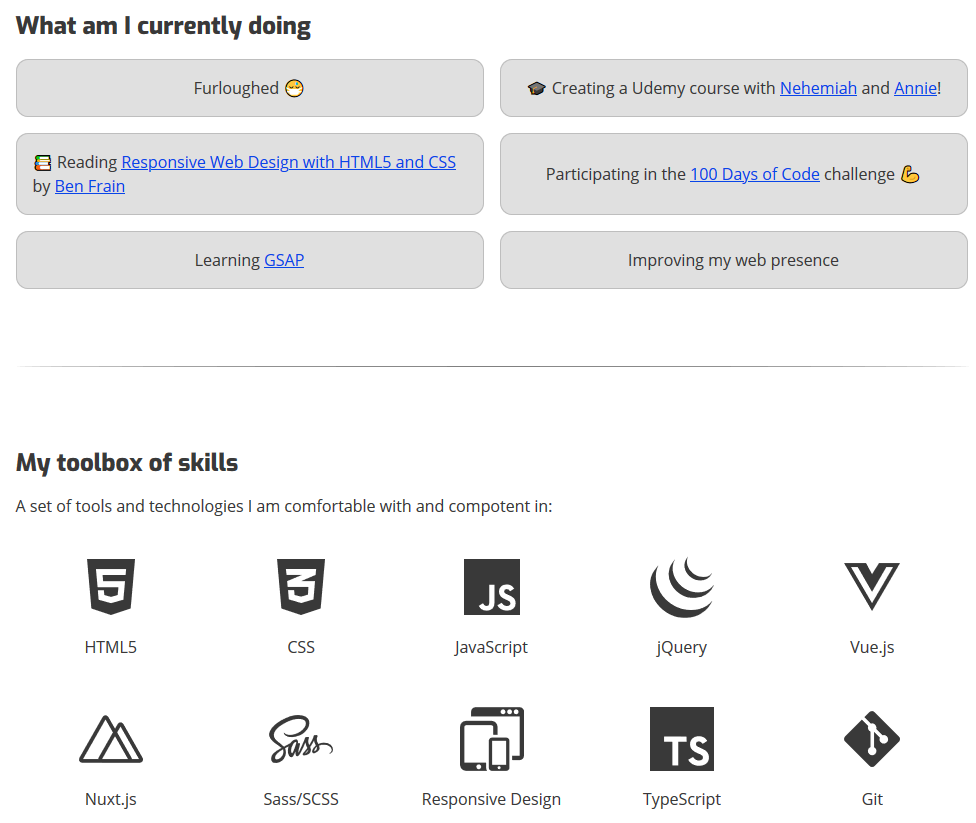](https://jackdomleo.dev)

---

### Day 33: June 26, 2020
##### Minor website improvements

**Today's Progress**: General refactoring. Tidied CSS.

**Thoughts:** I always love refactoring and tidying CSS, it allows you to step back and think, "This is how it was, now it's cleaner, how can I improve it?" For example, I improved my Buy Me a Coffee button.

**Link to work**: [My website](https://jackdomleo.dev)

**Tweet:** https://twitter.com/jackdomleo7/status/1276652403371257856

---

### Day 34: June 27, 2020
##### GSAP scrollTrigger and skeleton loader

**Today's Progress**: Tried GSAP's scrollTrigger for CodePen's challenge and really really struggled. 😔 I also implemented my own skeleton loader for my blog page.

**Thoughts:** Doing the scrollTrigger stuff made me realise that I need to stop diving in the deep end. I wasn't successful with my attempt. So, from now on I'm going to create a plan and look into interactive courses and really take my time learning something new. However, the skeleton loader looks pretty modern and neat.

**Link to work**: [My website's blog](https://jackdomleo.dev/blog)

**Tweet:** https://twitter.com/jackdomleo7/status/1277020339059466240

[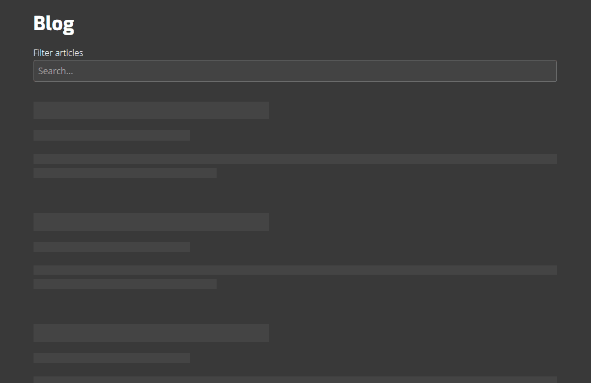](https://jackdomleo.dev/blog)

---

### Day 35: June 28, 2020
##### Website feedback

**Today's Progress**: Received some fantastic feedback from [Dan Spratling](https://twitter.com/dan_spratling) so made those changes.

**Thoughts:** Dan picked up on colour, accessibility, breakages and suggestions. I resolved a broken link, redefined all my colours so all text and link text against the background were WCAG AAA compilent for both dark and light themes. Fixed a width issue on my blog's skeleton loader and added a contact form to my home page using [Formspree](https://formspree.io).

**Link to work**: [My website](https://jackdomleo.dev)

**Tweet:** https://twitter.com/jackdomleo7/status/1277398891365892096

[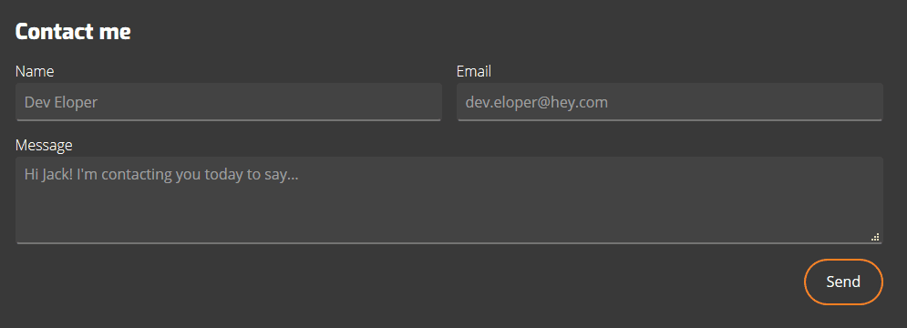](https://jackdomleo.dev)

---

### Day 36: June 29, 2020
##### Website feedback & eBook giveaway

**Today's Progress**: Resumed with feedback changes from [Dan Spratling](https://twitter.com/dan_spratling) and was offered to do a free [eBook](https://amzn.to/2WKBcjJ) giveaway event by [Packt Publishers](https://twitter.com/PacktPub).

**Thoughts:** Added a 'Top projects' section to my website and picked up on a few spelling typos 👀. The giveaway was an instant success, I'm enjoying the book so far and am really happy to have partnered with [Ravit Jain](https://twitter.com/RavitJain) at [Packt Publishers](https://twitter.com/PacktPub) to have arranged this.

**Link to work**: [My website](https://jackdomleo.dev)

**Tweet:** https://twitter.com/jackdomleo7/status/1277906094174633984

[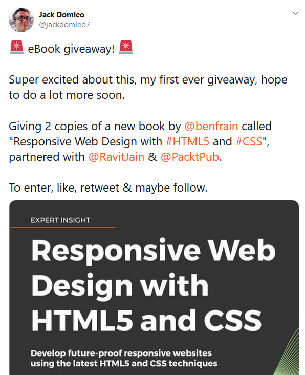](https://twitter.com/jackdomleo7/status/1277906094174633984)

---

### Day 37: June 30, 2020
##### Redesigned my website's projects page

**Today's Progress**: Redesigned my website's projects page to be neater.

**Thoughts:** You know that feel when something just needs redoing but you don't quite know why? Well, I redid my projects page.

**Link to work**: [My website's project page](https://jackdomleo.dev/projects)

**Tweet:** https://twitter.com/jackdomleo7/status/1278132145740005376

---

### Day 38: July 1, 2020
##### Nuxt Feed, Latest Blog & Giveaway winners announced

**Today's Progress**: I implemented an automatic updating RSS feed for my blog using [Nuxt Feed](https://github.com/nuxt-community/feed-module). I also added a [Latest article](https://jackdomleo.dev#latest) section to my home page. 2 days ago I announced a giveaway for an eBook and announced the two lucky winners today.

**Thoughts:** Implementing Nuxt Feed was easy, knowing I'd done it right was hard. I'd never seen a proper RSS feed before so had no idea whether what I'd created would actually work, but I used [Feedly](https://feedly.com) to check and it does 👍.

**Link to work**: [My RSS feed](https://jackdomleo.dev/feed.xml)

**Tweet:**
- https://twitter.com/jackdomleo7/status/1278451406240972800
- https://twitter.com/jackdomleo7/status/1278422168116891649

---

### Day 39: July 2, 2020
##### New article and refactored CodePen embedding into my website

**Today's Progress**: Released my first article of the Monthly Reflection series and tidied how I embed CodePen into my website.

**Thoughts:** I thought it would benefit me a lot if I had a log of what I have done and achieved each month - so I started with June 2020. Turns out I've done a lot. I also noticed, when I embed a new CodePen pen, I'm repeatig A LOT and it was getting messy, so I created a clean Vue component with some customisable props.

**Link to work**:
- [Monthly Reflection - June 2020](https://jackdomleo.dev/blog/monthly-reflection-june-2020)
- [CodePen component](https://github.com/JDomleo/jackdomleo.dev/blob/master/components/codepen.vue)

**Tweet:** https://twitter.com/jackdomleo7/status/1278817725389963264

---

### Day 40: July 3, 2020
##### Writing a new article

**Today's Progress**: No coding today, I wanted to start writing some articles that are on my idea list - it's getting quite long.

**Thoughts:** Started an article about stuttering, not really coding related, but oh well. I'm a stutterer myself and have had several people approach me on Twitter asking me about how I handle my stutter because they also stutter and were looking for guidance and advice.

**Tweet:** https://twitter.com/jackdomleo7/status/1279178295913914369

---

### Day 41: July 4, 2020
##### Published stuttering article

**Today's Progress**: No coding today, I wanted to finish this stuttering article.

**Thoughts:** I'm not entirely impressed with this article becasue it's not related directly to coding and tech but I'm glad I wrote it because stuttering is close to my heart.

**Link to work**: [A St-St-Stuttering Developer article](https://jackdomleo.dev/blog/a-st-st-stuttering-developer)

**Tweet:** https://twitter.com/jackdomleo7/status/1279528143297150976

---

### Day 42: July 5, 2020
##### Created an email for my jackdomleo.dev domain

**Today's Progress**: Created an email for jackdomleo.dev using G Suite as the mailing provider.

**Thoughts:** I thought it would be good and professional to have an email at my own domain - this now leaves me with 3 email addresses, hotmail, gmail and my domain email. I started to randomly stress because I couldn't decide which email I was going to use for what 😅. I'm having second thoughts about my domain email - I may just end getting rid of 2 of my email addresses because I only need one. I'm sure I'll decide eventually.

**Tweet:** https://twitter.com/jackdomleo7/status/1279886698768412673

---

### Day 43: July 6, 2020
##### New article, newsletter and contact form

**Today's Progress**: I wrote a new article called "@media (hover: hover) - CSS Media Query", created a newsletter signup form and added a contact form to [ellaparsons.design](https://ellaparsons.design/bio).

**Thoughts:** I've recently discovered and have been playing with the `hover: hover` CSS media query ([MDN web docs](https://developer.mozilla.org/en-US/docs/Web/CSS/@media/hover)) and been understanding why it's useful, so I decided to write a useful article about it. I have also decided to create a monthly newsletter using [Mailchimp](https://mailchimp.com) where I will share monthly updates about my most recent projects and articles. I also used [Formspree](https://formspree.io) to add a contact form to [ellaparsons.design](https://ellaparsons.design/bio).

**Link to work**: [@media (hover: hover) - CSS Media Query article](https://jackdomleo.dev/blog/hover-css-media-query)

**Tweet:** https://twitter.com/jackdomleo7/status/1280260933739253765

---

### Day 44: July 7, 2020
##### Rewatched entire All Day Hey 2020 conference

**Today's Progress**: I decided to make the most of my All Day Hey 2020 description so decided to rewatch the entire conference and read my own [review article](https://jackdomleo.dev/blog/all-day-hey-2020).

**Thoughts:** This was an interesting and educational conference the first time round, and still is today. I paid particular attention to the design pattern talks and writing a good, semantic, accessible button demonstration. The tweet says "Part 1", which implies there is more... There isn't, I got caught up changing my usernames on everything to 'jackdomleo7' so there was consistency for me.

**Link to work**: [All Day Hey: 2020 review](https://jackdomleo.dev/blog/all-day-hey-2020)

**Tweet:** https://twitter.com/jackdomleo7/status/1280465572929638402

---

### Day 45: July 8, 2020
##### JavaScript drumkit & created a Twitter bot

**Today's Progress**: Decided to start [Wes Bos's]() [JavaScript30](https://javascript30.com) course and day 1 was a JS drumkit. I also created a Twitter bot for #NoPreviewHtmlCss: The Challenge.

**Thoughts:** The JS drumkit is pretty cool, it plays sounds from a drumkit! I learned about the `transitionend` event, which I wasn't originally aware of, which is useful. I'm at that point now where I don't know what I don't know, so beginning to do some courses give me more feature ideas for projects, while bettering my knowledge.

**Link to work**:
- [JS drumkit](https://jackdomleo7.github.io/JavaScript30/01-javascript-drum-kit)
- [Twitter bot](https://twitter.com/NoPreviewHtmlCs)
- [Twitter bot code](https://github.com/jackdomleo7/twitter-bot-nopreviewhtmlcss)

**Tweet:** https://twitter.com/jackdomleo7/status/1281007313403490304

---

_Taking a few days break here for a long weekend trip to the British seaside_ 🏖

---
